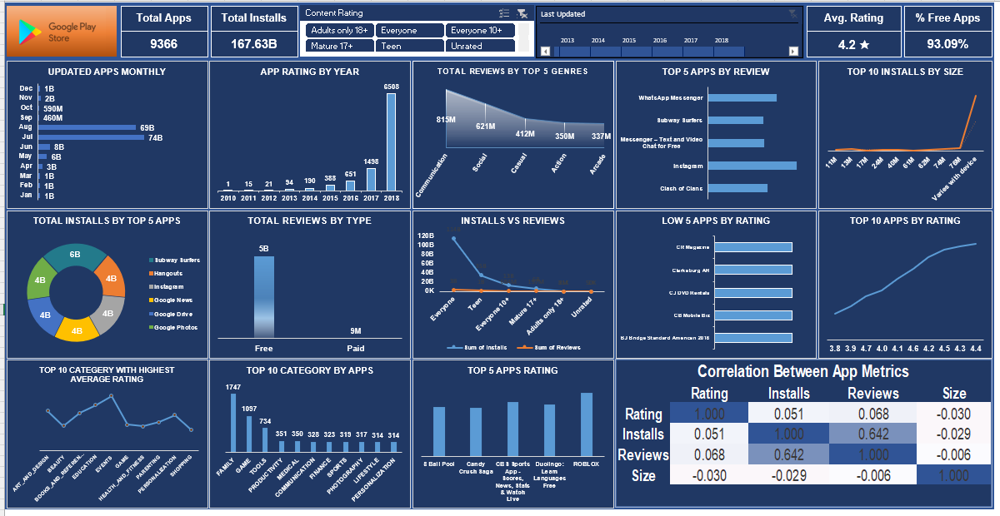

# Google Play Store Data Analysis Project

## Overview
Analysis of Google Play Store apps including install trends, ratings, categories, and correlations between metrics.

## Contents
- `Dashboard.xlsx`: Interactive Excel dashboard
- `googleplaystore.csv`: Raw dataset
- `googleplaystore.pdf`: Visual report
- `googleplay.png`: Project thumbnail

## Key Findings
- 9,366 apps analyzed with 167.63B total installs
- 93.09% of apps are free
- Top apps: Subway Surfers, Instagram, Google Drive
- Moderate correlation (0.642) between installs and reviews

## Repository Structure
- `data/`: Contains the raw Google store data
- `src/`: Excel dashboard file
- `docs/`: PDF report of findings
- `assets/`: Visualizations and screenshots

- 
## Technologies Used
- Excel (Data Analysis, Pivot Tables, Dashboards)
- Data Visualization
- Statistical Analysis
