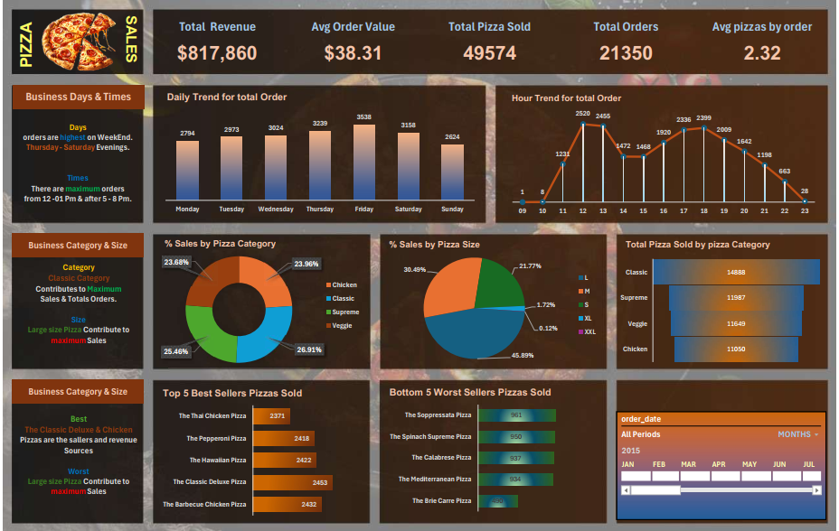

# Pizza Sales Analytics Dashboard

## Project Overview
Interactive Excel dashboard analyzing pizza sales data with key performance metrics and trends.

## Key Insights from Analysis
- **Total Revenue**: $817,860 from 21,350 orders
- **Busiest Times**: 
  - Peak days: Thursday-Saturday evenings
  - Peak hours: 12-1 PM & 5-8 PM
- **Top Categories**:
  - Classic (26.91%)
  - Supreme (25.46%)
  - Veggie (23.68%)
- **Best Sellers**:
  - The Classic Deluxe Pizza
  - The Barbecue Chicken Pizza
  - The Hawaiian Pizza

## Repository Structure
- `data/`: Contains the raw sales data
- `src/`: Excel dashboard file
- `docs/`: PDF report of findings
- `assets/`: Visualizations and screenshots

## Technologies Used
- Excel (Pivot Tables, Charts, Dashboards)
- Data Visualization
- Sales Performance Metrics
