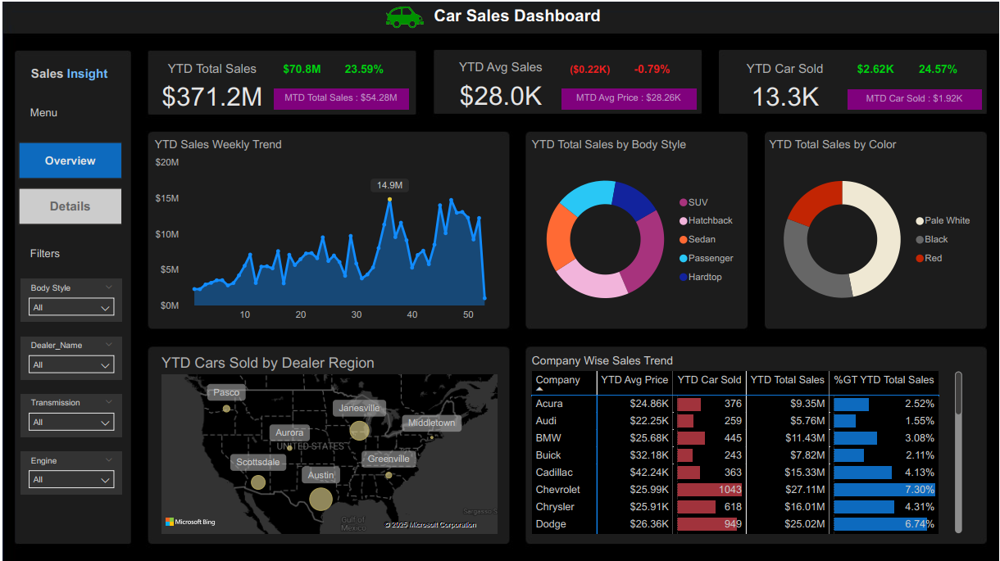

# Power BI Car Sales Analysis with DAX

## Project Overview
Interactive Power BI dashboard analyzing car sales performance with advanced DAX calculations.



## Key Insights from Analysis
- **Total YTD Sales**: $371.2M
- **Monthly Performance**: 
  - MTD Sales: $54.28M
  - MTD Cars Sold: 1.92K
- **Top Performers**:
  - Chevrolet: $27.11M (7.39% of total)
  - Dodge: $25.02M (6.74% of total)
  - Cadillac: Highest avg price ($42.24K)
- **Sales Trends**:
  - Weekly fluctuations between $5M-$20M
  - Pale White most popular color

## Repository Structure
- `data/`: Contains raw and processed datasets
- `src/`: Power BI file and DAX measures
- `docs/`: PDF report and calculation documentation
- `assets/`: Dashboard visuals and screenshots

## DAX Highlights
Key measures implemented:
```dax
YTD Sales = TOTALYTD(SUM(Sales[Total Sales]), 'Date'[Date])
MTD Sales = TOTALMTD(SUM(Sales[Total Sales]), 'Date'[Date])
Avg Price = DIVIDE(SUM(Sales[Total Sales]), COUNTROWS(Sales))
