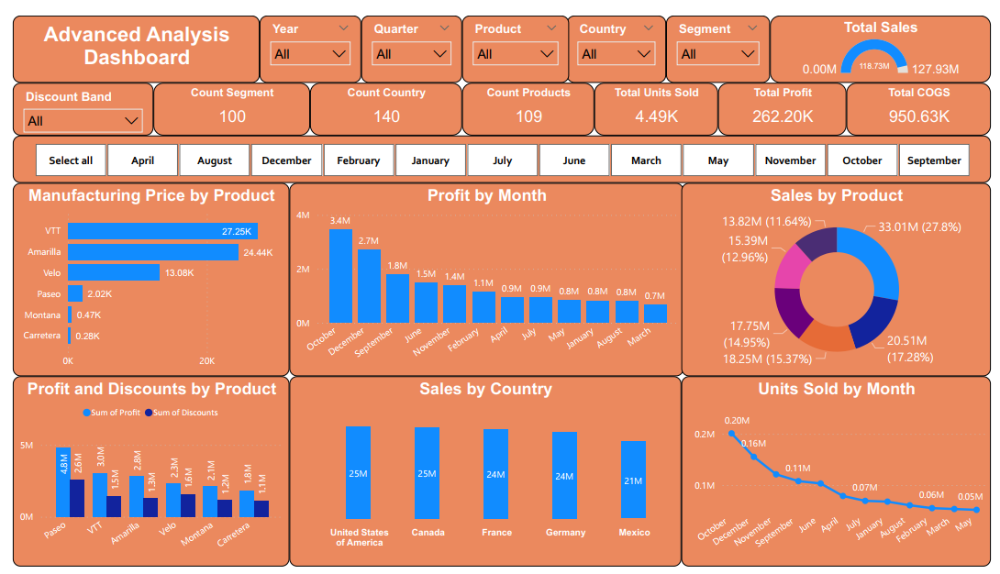

# Power BI Financial Data

# Project Overview

Interactive Power BI dashboard analyzing financial performance metrics with advanced DAX calculations including profit analysis, sales trends, and product performance.

# 🚀 Key Insights from Analysis
**🏆 Top Profit Month:**
October emerged as the most profitable month, generating $3.4M in profit, marking peak performance.

**📊 Product Performance:**
Paseo led in profitability with $4.8M but also recorded the highest discounts at $2.6M.

**🌎 Sales Distribution:**
United States and Canada were tied as top sales regions, each achieving $25M in sales.

**⚙️ Manufacturing Costs:**
The VTT product had the highest manufacturing cost, amounting to $27.25K.

**📈 Volume Leader:**
October also dominated in unit sales, selling 0.20M units.

