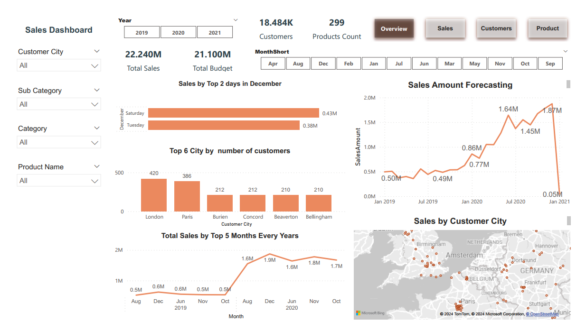

# Power BI Sales Dashboard

 <!-- Add a screenshot -->

## Overview
This Power BI dashboard provides interactive sales analytics for [Company/Organization Name], offering insights into sales performance, customer behavior, and product trends across multiple years (2019-2021). The dashboard helps stakeholders identify opportunities, track KPIs, and make data-driven decisions.

## Key Features
- **Interactive visualizations** with cross-filtering capabilities
- **Time intelligence** showing trends by year, quarter, and month
- **Geospatial analysis** of customer locations
- **Product performance** breakdown by categories and subcategories
- **Budget vs. Actual** comparison metrics
- **Forecasting** of future sales trends

## Dashboard Pages

### 1. Overview Page
- Key performance indicators (Total Sales, Budget, Products, Customers)
- Sales trend analysis
- Top performing months/cities
- Budget vs. Actual comparison

### 2. Sales Details
- Product category performance
- Top selling products
- Monthly sales patterns
- Sales to budget ratio analysis

### 3. Customer Analysis
- Customer demographics
- Geographic distribution
- Purchase history patterns
- Gender-based purchasing trends

### 4. Product Analysis
- Sales by Category: ( Bikes: $21.2M, Clothing: $320K, Accessories: $40K)
- Top subcategories (Road Bikes, Mountain Bikes, Touring Bikes)
- Quarterly sales trends (2019-2021)
- Lowest performing products (Racing Socks)
- Product model performance (Mountain-200, Road-250)
- Color analysis (Black, Blue, Multi, etc.)

