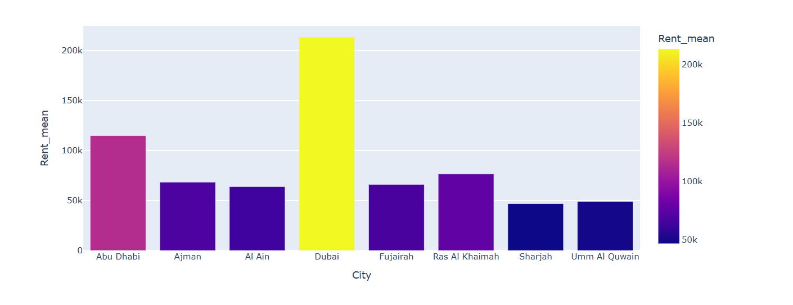
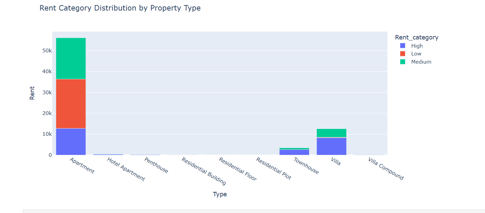
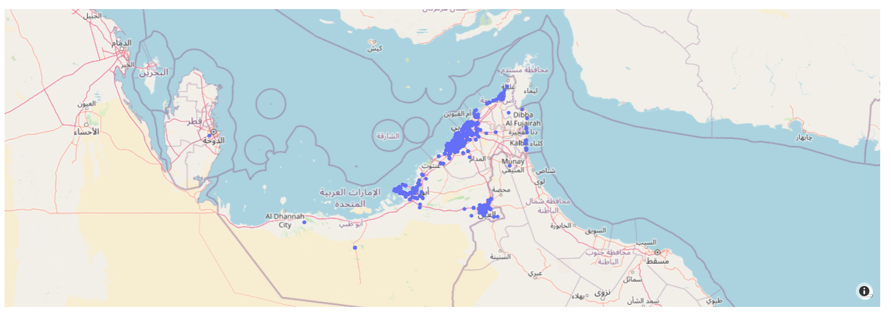

# 🏙️ Dubai Real Estate Rental Market Analysis  

  

## 📌 Overview  
This project analyzes the **UAE rental market** using a dataset of **73,742 property listings** from Kaggle. The goal is to uncover trends in pricing, occupancy, and property types across different cities in the UAE.  

🔗 **Dataset Source**: [Kaggle - Dubai Real Estate Goldmine](https://www.kaggle.com/datasets/azharsaleem/real-estate-goldmine-dubai-uae-rental-market)  

## 🎯 Key Insights  
✔ **Occupancy Rate**: 99.98% (only 17 vacant properties)  
✔ **Most Popular Property Type**: Apartments dominate the market  
✔ **Highest Rental Prices**: Found in **Palm Jumeirah, Downtown Dubai**  
✔ **Furnishing Trends**: Nearly equal split between furnished/unfurnished  

📊 **Interactive Dashboard**: [View Plotly Visualizations](http://localhost:8888/notebooks/Documents/Jupyter/Dubai_Real_Estate_Analysis.ipynb?)  

## 🛠️ Tools & Libraries  
- **Python (Pandas, NumPy)** – Data cleaning & analysis  
- **Seaborn & Plotly** – Interactive visualizations  
- **Jupyter Notebook** – Exploratory Data Analysis (EDA)  

## 📈 Key Visualizations  
| Analysis | Visualization |
|----------|--------------|
| Rental Prices by City |  |
| Property Types Distribution |  |
| Geospatial Rent Mapping |  |

